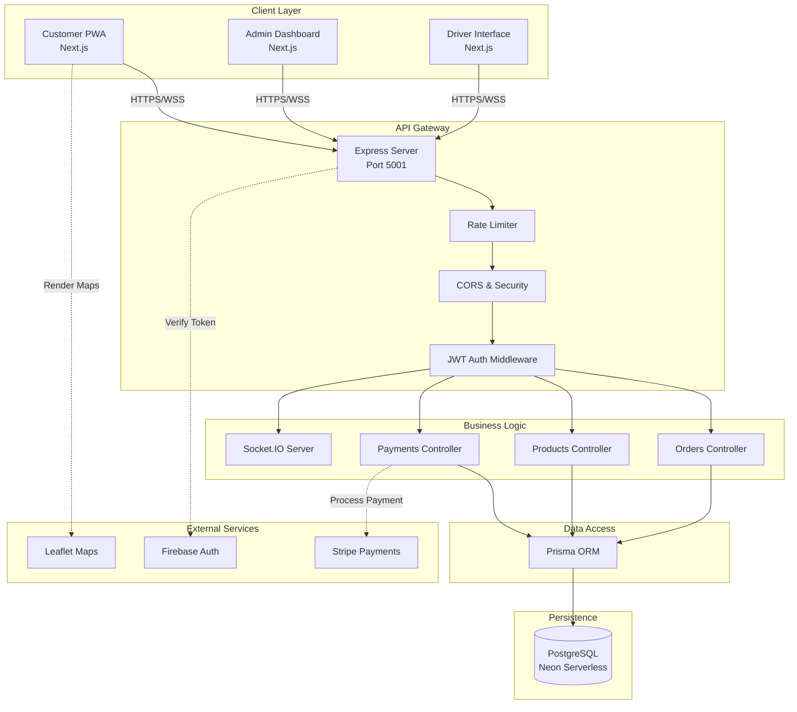
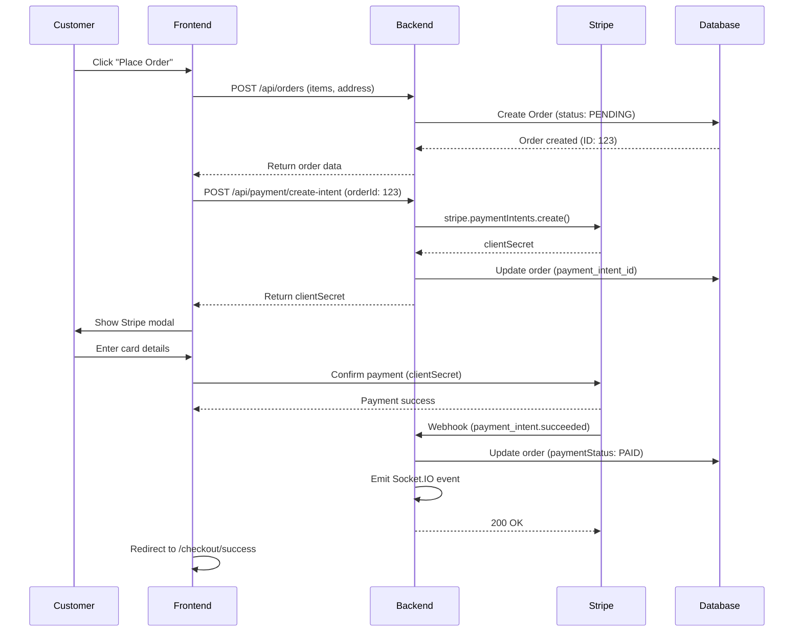
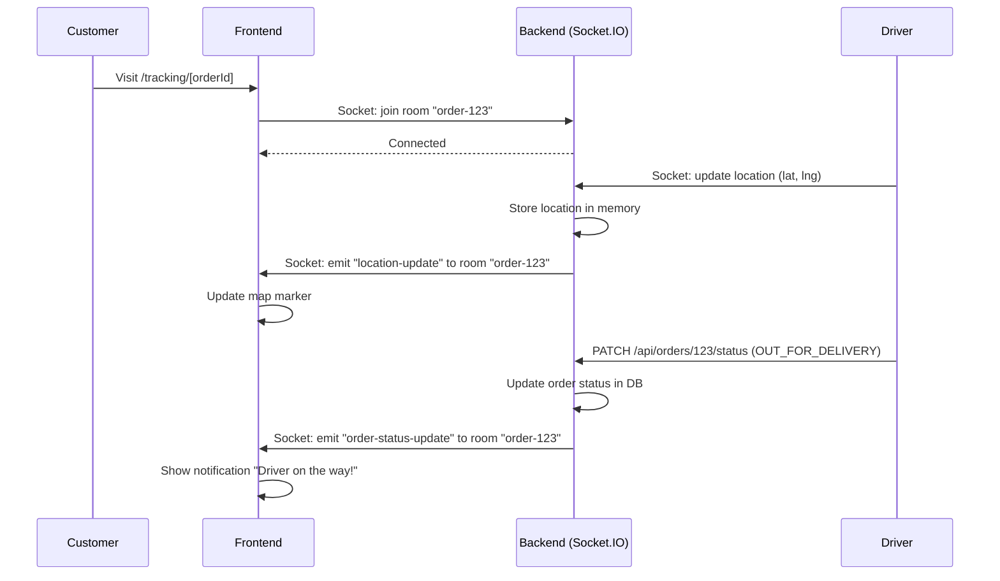

# 🏗️ System Architecture — Zor Pizza

## High-Level Overview



## Component Breakdown

### 1. Client Layer (Frontend)

**Technology**: Next.js 15 (App Router) + TypeScript + Tailwind CSS

**Components**:
- **Customer PWA**: 
  - Browse menu, customize orders
  - Real-time order tracking
  - Stripe payment modal
  - Push notifications
  - Installable as native app

- **Admin Dashboard**:
  - Real-time metrics (revenue, orders)
  - Product/order management (CRUD)
  - User/driver management
  - Analytics and reports

- **Driver Interface**:
  - Accept/reject deliveries
  - Navigate to customers
  - Update delivery status
  - Live location broadcasting

**State Management**: Zustand (global cart, user auth)

**Real-time**: Socket.IO client for live updates

---

### 2. API Gateway Layer

**Technology**: Express.js + TypeScript

**Responsibilities**:
- Request routing
- Security (Helmet, CORS)
- Rate limiting (100 req/min general, 20 req/min auth)
- JWT token verification (Firebase Admin SDK)
- Error handling
- Request/response logging (Morgan)

**Middleware Stack**:
```
Request → Trust Proxy → Helmet → CORS → Rate Limiter → Body Parser → JWT Auth → Controller
```

**Key Endpoints**:
- `/api/auth/*` — Authentication
- `/api/orders/*` — Order management
- `/api/payment/*` — Stripe integration
- `/api/products/*` — Product catalog
- `/api/tracking/*` — Real-time tracking
- `/api/dashboard` — Admin analytics

---

### 3. Business Logic Layer

**Pattern**: MVC (Model-View-Controller) + Service Layer

**Controllers** (`backend/src/controllers/`):
- Receive HTTP requests
- Validate input (Zod schemas)
- Call services/Prisma
- Return JSON responses

**Services** (implicit in controllers):
- Business rules (e.g., loyalty points calculation)
- Third-party API calls (Stripe, Firebase)
- Complex queries

**Socket.IO Server**:
- Manages WebSocket connections
- Broadcasts order updates to specific rooms
- Handles driver location updates

**Example Flow** (Create Order):
```
Client → POST /api/orders → OrdersController.create() 
  → Validate input (Zod)
  → Calculate total price + discounts
  → Prisma.order.create()
  → Emit Socket.IO event to admin room
  → Return order JSON to client
```

---

### 4. Data Access Layer

**Technology**: Prisma ORM

**Features**:
- Type-safe database queries
- Auto-generated TypeScript types
- Migration management
- Connection pooling (for serverless)

**Database Models**:
```prisma
User (Customer/Admin/Driver)
  ├─ Orders (1:N)
  ├─ Reviews (1:N)
  ├─ Addresses (1:N)
  └─ LoyaltyTransactions (1:N)

Order
  ├─ OrderItems (1:N)
  ├─ User (N:1)
  ├─ Branch (N:1)
  └─ Driver (N:1, optional)

Product
  ├─ OrderItems (1:N)
  ├─ Category (N:1)
  └─ Reviews (1:N)
```

**Performance Optimizations**:
- Indexed foreign keys
- Eager loading with `include` for related data
- Pagination for large datasets
- Connection pooling for serverless (Neon)

---

### 5. Persistence Layer

**Technology**: PostgreSQL (Neon Serverless)

**Schema Highlights**:
- **Users**: Firebase UID + local ID (hybrid auth)
- **Orders**: Status tracking (PENDING → CONFIRMED → PREPARING → OUT_FOR_DELIVERY → DELIVERED)
- **Products**: Polymorphic (Pizza, Beverage, Dessert)
- **Payments**: Stripe PaymentIntent ID for reconciliation

**Backup Strategy**:
- Neon automatic backups (daily)
- Point-in-time recovery (7 days)

---

### 6. External Services

#### Firebase Authentication
- User sign-up/login
- JWT token generation
- Admin role management
- Frontend SDK handles session persistence

**Integration**: 
- Frontend uses Firebase JS SDK
- Backend verifies tokens with Firebase Admin SDK

#### Stripe Payments
- PaymentIntent API for card payments
- Google Pay support
- Webhook for payment confirmation
- Test mode for development

**Security**:
- Webhook signature verification
- Idempotency keys to prevent duplicate charges

#### Leaflet Maps
- Open-source alternative to Google Maps
- Driver location visualization
- Customer delivery tracking

---

## Data Flow Examples

### 1. Place Order (Card Payment)



### 2. Real-time Order Tracking



---

## Security Measures

### Authentication & Authorization
- Firebase JWT tokens (60-min expiration)
- Role-based access control (CUSTOMER, ADMIN, DRIVER)
- Protected routes with `authenticateFirebaseToken` middleware

### Data Protection
- Helmet.js for HTTP headers (XSS, MIME sniffing protection)
- CORS whitelist (only allowed frontend origins)
- Rate limiting (prevent brute-force/DDoS)
- Input validation with Zod (prevent SQL injection)

### Payment Security
- PCI-compliant (Stripe handles card data)
- Webhook signature verification
- HTTPS-only in production

### Secrets Management
- `.env` files (never committed)
- Railway/Vercel environment variables
- Firebase service account keys (base64-encoded)

---

## Scalability Considerations

### Current Architecture (MVP)
- **Frontend**: Serverless (Vercel) — auto-scales
- **Backend**: Single Railway instance (512 MB RAM)
- **Database**: Neon serverless (connection pooling)
- **Socket.IO**: In-memory (single server)

### Future Scaling (Phase 3)

**Horizontal Scaling**:
- Deploy multiple backend instances behind a load balancer
- Use Redis for Socket.IO adapter (sync across instances)
- Add Redis for session/cache management

**Database Optimization**:
- Add read replicas for analytics queries
- Implement database sharding (by region/franchise)
- Use materialized views for dashboards

**CDN & Caching**:
- Cache product images on CDN (Cloudflare/Vercel)
- Add Redis for frequent queries (menu, deals)
- Implement browser caching headers

**Monitoring**:
- Set up Sentry for error tracking
- Use Datadog/New Relic for APM
- Add Prometheus + Grafana for metrics

---

## Deployment Pipeline

### Development
```bash
git push origin feature-branch
  ↓
GitHub Actions (lint + test)
  ↓
Manual deploy to staging
  ↓
QA testing
```

### Production
```bash
git push origin main
  ↓
GitHub Actions (lint + test)
  ↓
Auto-deploy:
  - Frontend → Vercel
  - Backend → Railway
  ↓
Health check (smoke tests)
  ↓
Live ✅
```

### Rollback Strategy
- Frontend: Vercel instant rollback (UI button)
- Backend: Railway rollback to previous deploy
- Database: Point-in-time recovery (manual)

---

## File Structure

```
Zo-rPizza/
├── frontend/                    # Next.js app
│   ├── app/                     # App Router pages
│   │   ├── (shop)/             # Customer-facing routes
│   │   ├── (admin)/            # Admin dashboard
│   │   └── layout.tsx          # Root layout
│   ├── components/             # Reusable components
│   ├── lib/                    # Utils, hooks, stores
│   ├── __tests__/              # Jest + React Testing Library
│   └── package.json
│
├── backend/                     # Express API
│   ├── src/
│   │   ├── controllers/        # Route handlers
│   │   ├── middleware/         # Auth, rate limiting
│   │   ├── routes/             # API endpoints
│   │   ├── lib/                # Utils, Prisma client
│   │   └── server.ts           # App entry point
│   ├── prisma/
│   │   ├── schema.prisma       # Database schema
│   │   ├── migrations/         # SQL migrations
│   │   └── seed.ts             # Sample data
│   ├── tests/                  # Jest + Supertest
│   └── package.json
│
├── docs/                        # Documentation
│   ├── ARCHITECTURE.md         # This file
│   ├── TESTING_VA_IMPROVEMENT_REJA.md
│   └── screenshots/            # README images
│
├── pnpm-workspace.yaml         # Monorepo config
└── package.json                # Root scripts
```

---

## Technology Rationale

| Choice | Reason |
|--------|--------|
| **Next.js** | SEO, SSR, API routes, zero config |
| **TypeScript** | Type safety, better DX, fewer bugs |
| **Prisma** | Type-safe ORM, migrations, great DX |
| **PostgreSQL** | ACID compliance, JSON support, mature |
| **Express** | Lightweight, flexible, huge ecosystem |
| **Socket.IO** | Easy real-time, fallbacks, rooms |
| **Stripe** | Best payment UX, strong security, docs |
| **Firebase Auth** | Free tier, easy setup, mobile support |
| **pnpm** | Faster than npm/yarn, disk-efficient |
| **Tailwind CSS** | Rapid prototyping, consistent design |

---

## Performance Metrics (Target)

| Metric | Target | Current |
|--------|--------|---------|
| Time to First Byte (TTFB) | < 200ms | ~150ms |
| First Contentful Paint (FCP) | < 1.8s | ~1.2s |
| Largest Contentful Paint (LCP) | < 2.5s | ~2.1s |
| Time to Interactive (TTI) | < 3.8s | ~3.5s |
| API Response Time (p95) | < 500ms | ~300ms |
| Database Query Time (p95) | < 100ms | ~80ms |
| Socket.IO Latency | < 100ms | ~50ms |

---

## Conclusion

This architecture balances **simplicity** (MVP speed) with **scalability** (future growth). Key strengths:

- ✅ **Type-safe** end-to-end (TypeScript + Prisma)
- ✅ **Real-time** without polling (Socket.IO)
- ✅ **Secure** (Firebase + JWT + rate limiting)
- ✅ **Testable** (high coverage, mocked external deps)
- ✅ **Deployable** (CI/CD, serverless-ready)

For questions or improvements, open an issue on GitHub!
